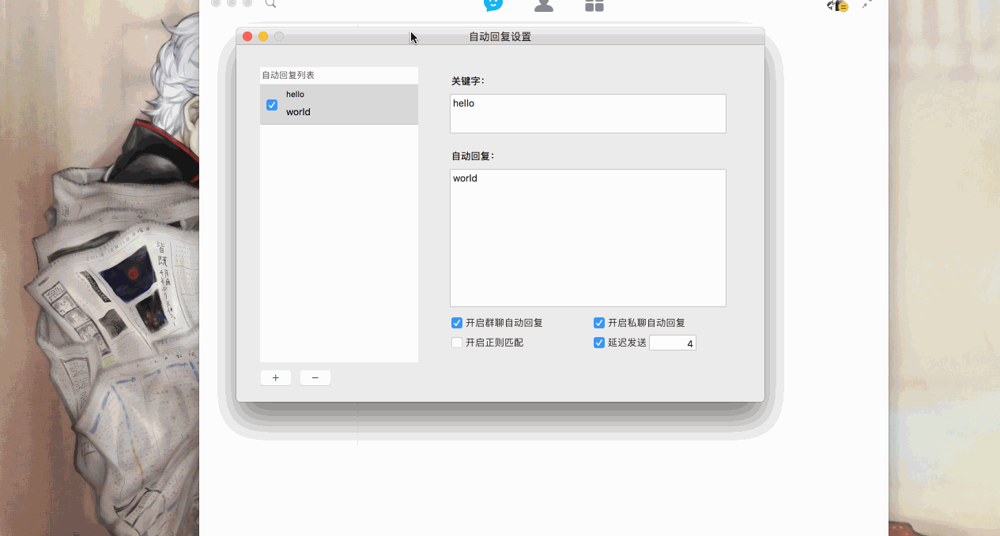
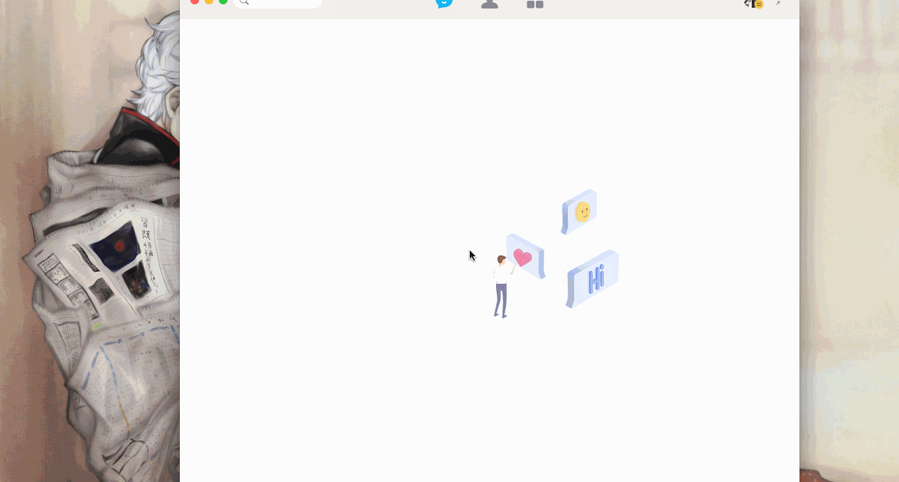
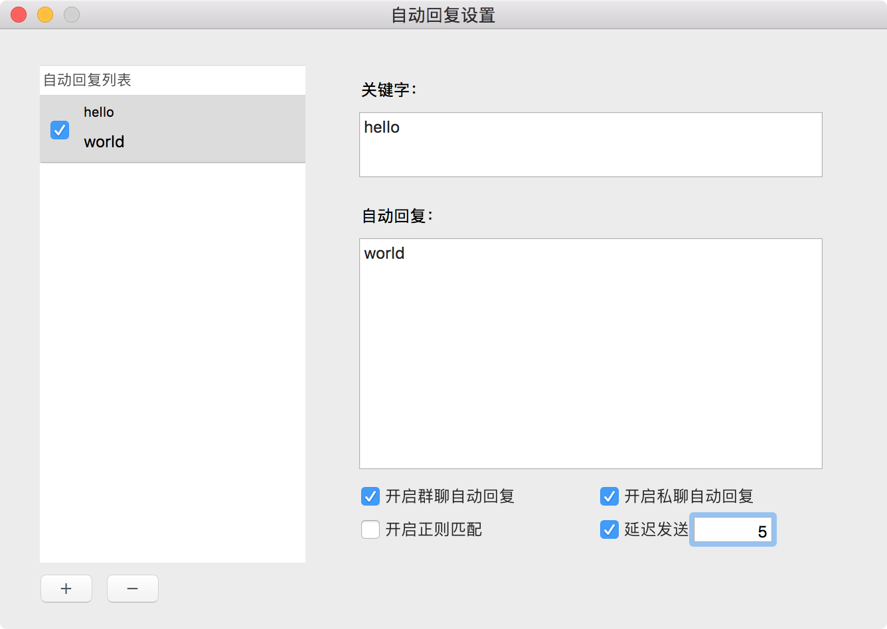

## QQPlugin-MacOS

    

QQ 小助手 

---

### 功能

* 消息自动回复
* 消息防撤回
* alfred 快捷发送消息 & 打开窗口 & 查看聊天记录

---

### 安装

~~第一次安装需要输入密码，仅是为了获取写入微信文件夹的权限~~

**0. 懒癌版安装(适合非程序猿 && 有安装 git)**

打开`应用程序-实用工具-Terminal(终端)`，执行以下命令并根据提示输入密码即可。**(需要git支持)**

`cd ~/Downloads && rm -rf QQPlugin-MacOS && git clone https://github.com/TKkk-iOSer/QQPlugin-MacOS.git --depth=1 && ./QQPlugin-MacOS/Other/Install.sh`

**1. 普通安装**

* 点击`clone or download`按钮下载 QQPlugin 并解压，打开Terminal(终端)，拖动解压后`Install.sh` 文件(在 Other 文件夹中)到 Terminal 回车即可。

---

### Demo 演示

* 自动回复&防撤回    

* Alfred扩展    

---

### 使用

* 消息防撤回：点击`开启消息防撤回`或者快捷键`command + shift + t`,即可开启、关闭。
* 自动回复：点击`开启自动回复`或者快捷键`conmand + shift + k`，将弹出自动回复设置的窗口，点击红色箭头的按钮设置开关。    

>若关键字为 `*`，则任何信息都回复；
>若关键字为`x|y`,则 x 和 y 都回复；
>若关键字**或者**自动回复为空，则不开启该条自动回复;
>若开启正则，请确认正则表达式书写正确，[在线正则表达式测试](http://tool.oschina.net/regex/)
> 可设置延迟发送回复，单位：秒.

* Alfred 使用：跟 微信`Alfred`类似，关键字为`q`. 

---

### 卸载

将项目中的`./Other/Uninstall.sh`拖到`Terminal`(终端)运行即可.

---

### 依赖

* [XMLReader](https://github.com/amarcadet/XMLReader)
* [insert_dylib](https://github.com/Tyilo/insert_dylib)
* [fishhook](https://github.com/facebook/fishhook)
* [GCDWebServer](https://github.com/swisspol/GCDWebServer)   
* [Alfred-Workflow](http://www.deanishe.net/alfred-workflow/index.html)

---

### Other

~~若有其他好的想法欢迎 Issue me~~

更新是不可能更新的，这辈子都不可能更新，只能逛逛github才能维持生活这样子

---

#### 听说你想请我喝下午茶？😏
 
&nbsp;&nbsp;&nbsp;

